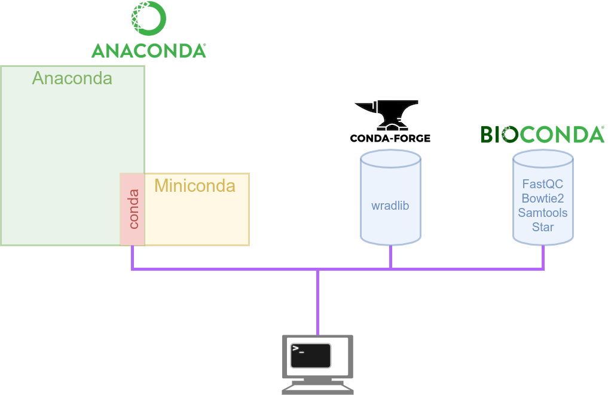

class: center, middle

# Introduction à Conda

## M2BI 2019-2020


<br /><br /><br /><br /><br /><br />

.leftcol[

 </img>
]

.righcol.right[
<br /><br />
Pierre Poulain <br />
pierre.poulain@univ-paris-diderot.fr <br />
@pierrepo
]

.footer[
Ce contenu est mis à disposition selon les termes de la licence Creative Commons BY-SA 4.0
]

---

layout: true
name: title
class: center, middle
.footer[
Poulain 2019 CC BY-SA
]

---

layout: true
name: contentleft
class: top, left
.footer[
Poulain 2019 CC BY-SA
]

---

layout: true
name: contentcenter
class: top, center
.footer[
Poulain 2019 CC BY-SA
]

---

template: contentleft

# Objectifs d'apprentissage

--

- Décrire et expliquer l'organisation de l'écosytème conda.

- Utiliser et créer un environnement conda.

- Dupliquer un environnement conda.

---
template: contentleft

# XXXconda 🐍

[Anaconda](https://www.anaconda.com/)
- Distribution open source.
- Disponible pour Windows, Mac et Linux.
- Installable sans être **administrateur**.
- Nombreux outils pour l'analyse de données.

--

[Miniconda](https://docs.conda.io/en/latest/miniconda.html)
- Version *light* d'Anaconda (le strict minimum).
- Aussi installable sans être **administrateur**.

--

[Conda](https://docs.conda.io/projects/conda/en/latest/index.html) ([Cheat sheet](https://docs.conda.io/projects/conda/en/latest/_downloads/1f5ecf5a87b1c1a8aaf5a7ab8a7a0ff7/conda-cheatsheet.pdf) / [liste des logiciels](https://anaconda.org/search))
- Gestionnaire de logiciels.
- Installé avec Anaconda et Miniconda.
- Basé sur Python.

--

[Bioconda](https://bioconda.github.io/)
- Canal de diffusion de logiciels utilisés en bioinformatique.
- Utilisable par le gestionnaire de paquets conda.


---
template: contentleft

# L'écosystème Conda 🐍

.center[

]


---
template: contentleft

# Installer Miniconda (au labo, à la maison)

<https://docs.conda.io/en/latest/miniconda.html>

- Miniconda > Anaconda (plus léger)
- Miniconda**3**

<br /><br />

Notice : <https://python.sdv.univ-paris-diderot.fr/annexe_install_python/> 👍

---
template: contentleft

# Utiliser Miniconda (au labo, à la maison)

.leftcol[
### Créer un environnement 
```
$ conda create -n test-end
```

### Charger un environnement 
```
$ conda activate test-env
```
🔍 Le prompt est modifié !

### Quitter un environnement
```
$ conda deactivate
```
]
--

.rightcol[
### Chercher un logiciel
```
$ conda search jupyterlab
$ conda search -c bioconda fastqc
```

### Installer un logiciel
```
$ conda install jupyterlab
$ conda install -c bioconda samtools
```
⚠ Pas besoin d'être administrateur !

ou encore `$ pip install numpy`

### Supprimer un logiciel 
```
$ conda remove jupyterlab
```

]


---
template: contentleft

# Utiliser Miniconda (au labo, à la maison) (2)

.leftcol[
### Décrire l'environnement dans un fichier yaml (rnaseq.yml)

```
name: rnaseq-test
channels:
    - defaults
    - bioconda
    - conda-forge
dependencies:
    - fastqc
    - bowtie2
    - htseq
    - samtools=1.9
```
]

.rightcol[
### Créer un environnement
```
$ conda env create -f rnaseq.yml
```

### Supprimer un environnement
```
$ conda env remove -n rnaseq-test
```
]


---
template: contentleft

# Gérer les environnements

.leftcol[
### Lister les environnements disponibles
```
$ conda env list
```

### Lister les logiciels installés dans un environnement (et leurs versions)
```
$ conda list -n ENVNAME
```
]

--

.rightcol[
### Exporter un environnement dans un fichier yaml
```
$ conda env export -n ENVNAME > envname.yml
```

sans la localisation exacte :
```
$ conda env export -n ENVNAME | grep -v "^prefix:" > envname.yml
```

<br />
puis, ailleurs, plus tard :
```
$ conda env create -f envname.yml
```
]


---
template: contentleft

# Utiliser Miniconda (dans les salles infos)

Miniconda est déjà installé 😃

--

<br />

**Ne l'installez pas dans vos sessions utilisateurs !**

.center[
	
]


---
template: contentleft

# Utiliser Miniconda (dans les salles infos) (2)

### Utiliser les environnements des profs
```
$ conda env list
$ conda activate ENVNAME
$ ...
$ conda deactivate
```


---
template: contentleft

# Utiliser Miniconda (dans les salles infos) (3)

### Installer VOTRE environnement (dans votre répertoire utilisateur)
```
$ conda env create -f envname.yml -p /path/to/env/
```

Exemple :
```
$ conda env create -f rnaseq.yml -p ~/scratch/rnaseq-env/
```

--
### Charger VOTRE environnement 
```
$ conda activate /path/to/env/
```

Exemple :
```
$ conda activate ~/scratch/rnaseq-env/
```


---
template: contentleft

# Utiliser Miniconda (dans les salles infos) (4)

### Quitter VOTRE environnement
```
$ conda deactivate
```

--
### Supprimer VOTRE environnement
```
$ conda env remove -p /path/to/env/
```
Exemple :
```
$ conda env remove -p ~/scratch/rnaseq-env/
```

---
template: contentleft

# Conseils 

- Utilisez des environnements conda.

--

- Décrivez vos environnements dans des fichiers yaml.

--

- Versionnez les fichiers yaml.

--

- Expérimentez / testez !

.center[
	
]

---
template: contentleft

# Références 

Deux articles très intéressants sur conda :
 
- [Conda le meilleur ami du bioinformaticien](https://bioinfo-fr.net/conda-le-meilleur-ami-du-bioinformaticien). Article d'introduction. Attention cependant, certaines commandes sont obsolètes.
- [Comment fixer les problèmes de déploiement et de durabilité des outils en bioinformatique ? Indice : conda !](https://bioinfo-fr.net/comment-fixer-les-problemes-de-deploiement-et-de-durabilite-des-outils-en-bioinformatique). Article un peu plus technique.

<br />
Le papier de référence de Bioconda :

- [Bioconda: sustainable and comprehensive software distribution for the life sciences](https://www.nature.com/articles/s41592-018-0046-7), Björn Grüning et *al.*, Nature methods, 2018.
---
template: contentleft

background-color: #cccccc

# C'est parti ! 🚀

## 💻 [Tutoriel](https://omics-school.github.io/analyse-rna-seq/analyse_RNA-seq_O_tauri.html)

