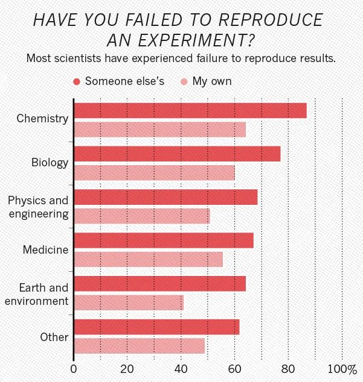
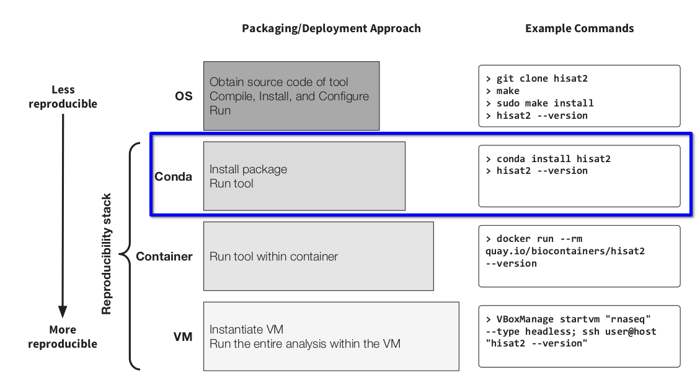
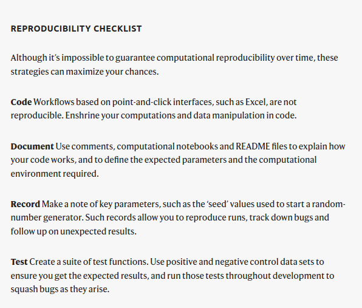
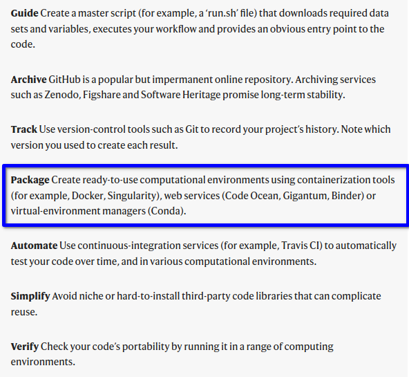

class: center, middle

# Introduction à Conda

## M2BI 2021-2022


<br /><br /><br /><br /><br /><br />

.leftcol[

 </img>
]

.righcol.right[
<br /><br />
Pierre Poulain <br />
pierre.poulain@u-paris.fr <br />
@pierrepo
]

.footer[
Ce contenu est mis à disposition selon les termes de la licence Creative Commons BY-SA 4.0
]

---

layout: true
name: title
class: center, middle
.footer[
P. Poulain ~ CC BY-SA
]

---

layout: true
name: contentleft
class: top, left
.footer[
P. Poulain ~ CC BY-SA
]

---

layout: true
name: contentcenter
class: top, center
.footer[
P. Poulain ~ CC BY-SA
]

---

template: contentleft

font-size: 200%
# Objectifs d'apprentissage

--

- Décrire et expliquer l'organisation de l'écosytème conda.

- Utiliser et créer un environnement conda.

- Stocker la description d'un environnement conda dans un fichier.

- Construire votre propre environnement conda.


---
template: contentleft

# Pourquoi ?

--

Améliorer la reproductibilité en science.
--
 Parce que pour le moment, on n'est pas très bon...

.center[


]

.ref[
1,500 scientists lift the lid on reproducibility<br />
Baker, *Nature*, 2016.<br />
https://www.nature.com/news/1-500-scientists-lift-the-lid-on-reproducibility-1.19970
]


---
template: contentleft

# Le premier niveau

.center[

]

.ref[
Practical Computational Reproducibility in the Life Sciences<br />
Grüning *et al*, *Cell Systems*, 2018.<br />
DOI [10.1016/j.cels.2018.03.014](https://doi.org/10.1016/j.cels.2018.03.014)
]


---
template: contentleft

# Recommendations for the packaging and containerizing of bioinformatics software

1. **A package first**
2. One tool, one container
3. Tool and container versions should be explicit
4. Avoid using ENTRYPOINT
5. Reduce the size of your container as much as possible
6. Keep data outside of the container
7. Add functional testing logic
8. Check the license of the software
9. Make your package or container discoverable
10. Provide reproducible and documented builds
11. Provide helpful usage message

> *Conda, is a popular package manager in research software, it
quickly installs, runs and updates packages and their dependencies. 
It handles dependencies for many languages, such as
C, C++, R, Java, Perl, and Python. It works cross-platform and
does not require special permissions for installation of itself
or requested packages.*

.ref[
Recommendations for the packaging and containerizing of bioinformatics software<br />
Gruening, *F1000 Research*, 2019. DOI [10.12688/f1000research.15140.2](https://doi.org/10.12688/f1000research.15140.2)
]


---
template: contentleft

# Challenge to scientists: does your ten-year-old code still run?

.center[


]

.ref[
Challenge to scientists: does your ten-year-old code still run?<br />
Perkel, *Nature*, 2020.<br />
DOI [10.1038/d41586-020-02462-7](https://doi.org/10.1038/d41586-020-02462-7)
]


---
template: contentleft

# L'écosystème Conda 🐍

[Anaconda](https://www.anaconda.com/)
- Distribution open source.
- Disponible pour Windows, Mac et Linux.
- Installable sans être **administrateur**.
- Très nombreux outils pour l'analyse de données (plusieurs centaines).

<br />
--

[Miniconda](https://docs.conda.io/en/latest/miniconda.html)
- Version *light* d'Anaconda (le strict minimum).
- Aussi installable sans être **administrateur**.

<br />
--

[Conda](https://docs.conda.io/projects/conda/en/latest/index.html) ([Cheat sheet](https://docs.conda.io/projects/conda/en/latest/_downloads/843d9e0198f2a193a3484886fa28163c/conda-cheatsheet.pdf))
- Gestionnaire de paquets (**logiciels**) et d'**environnements**
- Installé avec Anaconda et Miniconda.
- Basé sur Python mais peut installer R, C++, Julia...
- Liste des logiciels : https://anaconda.org/search
---
template: contentleft

# L'écosystème Conda 🐍

[Bioconda](https://bioconda.github.io/)
- Canal de diffusion de logiciels utilisés en bioinformatique (>7000 paquets).
- Utilisable par le gestionnaire de paquets conda.

<br />
<br />
<br />
<br />
Bioconda: sustainable and comprehensive software distribution for the life sciences<br />
Grüning et *al.*, *Nature methods*, 2018.<br />
DOI [10.1038/s41592-018-0046-7](https://doi.org/10.1038/s41592-018-0046-7)


---
template: contentleft

# L'écosystème Conda

.center[

]


---
template: contentleft

# Qu'est-ce qu'on installe (Windows, Mac, Linux) ?

https://docs.conda.io/en/latest/miniconda.html

--

⚠️ Beaucoup de logiciels de bioinfo dans Bioconda ne sont disponibles que pour Mac et Linux.

Par exemple :

- [star](https://anaconda.org/bioconda/star)
- [bowtie2](https://anaconda.org/bioconda/bowtie2)
- [gromacs](https://anaconda.org/bioconda/gromacs)

--

mais parfois 🥳 [fastqc](https://anaconda.org/bioconda/fastqc)

--

<br />
<br />
Mon conseil :

- Linux ➡️ Linux installers + Python 3.x
- MacOSX ➡️ MacOSX installers + Python 3.x
- Windows 10 ➡️ [Windows Subsystem for Linux](https://github.com/pierrepo/intro-wsl) (WSL) ➡️ Linux installers + Python 3.x


---
template: contentleft

# Installer Miniconda (au labo, à la maison)

<https://docs.conda.io/en/latest/miniconda.html>

- Préférez Miniconda à Anaconda
- Miniconda**3**

<br /><br />

Notice : <https://python.sdv.univ-paris-diderot.fr/annexe_install_python/> 👍

---
template: contentleft

# Utiliser Miniconda (dans les salles infos)

Miniconda est déjà installé 😃. La preuve :

```bash
$ conda --version
conda 4.14.0
```

--

**Ne l'installez pas dans vos sessions utilisateurs !**

.center[
	
]


---
template: contentleft

# Utiliser Miniconda

.leftcol[
### Chercher un logiciel
```
$ conda search jupyterlab
$ conda search -c bioconda hisat2
```

ou en ligne https://anaconda.org/search


### Installer un logiciel
```
$ conda install jupyterlab
$ conda install -c bioconda hisat2
```
⚠ Pas besoin d'être administrateur !

]
--

.rightcol[
### Supprimer un logiciel 
```
$ conda remove jupyterlab
```
<br />
<br />
<br />
<br />

]

--

⚠ Ne jamais installer de logiciel dans l'environnement `base` qui est l'environnement par défaut.

Utilisez des **environnements** !

---
template: contentleft

# Utiliser Miniconda (environnements)

.leftcol[
### Créer un environnement 
```
$ conda create -n test-env
```

### Charger un environnement 
```
$ conda activate test-env
```
🔍 Le prompt est modifié !

### Quitter un environnement
```
$ conda deactivate
```

]

.rightcol[

### Lister les logiciels installés dans un environnement
```
$ conda list
```

### Lister les environnements existants
```
$ conda env list
```
<br />
<br />
<br />
<br />

]

--

**Un projet = un environnement**

---
template: contentleft

# Utiliser Miniconda

.leftcol[
### Décrire l'environnement dans un fichier yaml (rnaseq.yml)

```
name: rnaseq
channels:
    - defaults
    - bioconda
    - conda-forge
dependencies:
    - fastqc
    - bowtie2
    - htseq
    - samtools=1.9
```
]

.rightcol[
### Créer un environnement
```
$ conda env create -f rnaseq.yml
```

### Créer un environnement (avec un nom différent)
```
$ conda env create -f rnaseq.yml -n test2
```

### Supprimer un environnement
```
$ conda env remove -n rnaseq
$ conda env remove -n test2
```
]


---
template: contentleft

# Gérer les environnements

.leftcol[
### Lister les environnements disponibles
```
$ conda env list
```

### Lister les logiciels installés dans un environnement (et leurs versions)
```
$ conda list -n ENVNAME
```
]

--

.rightcol[
### Exporter un environnement dans un fichier yaml
```
$ conda env export -n ENVNAME > envname.yml
```

sans la localisation exacte :
```
$ conda env export -n ENVNAME \
 | grep -v "^prefix:" > envname.yml
```

sans la localisation exacte et les numéros de build :
```
$ conda env export -n ENVNAME --no-builds \
 | grep -v "^prefix:" > envname.yml
```

<br />
puis, ailleurs, plus tard :
```
$ conda env create -f envname.yml
```
]


---
template: contentleft

# Utiliser Miniconda (dans les salles infos)

### Utiliser les environnements des profs
```
$ conda env list
$ conda activate ENVNAME
$ ...
$ conda deactivate
```


---
template: contentleft

# Utiliser Miniconda (dans les salles infos)

### Installer VOTRE environnement

Vous n'avez les droits pour créer des environnements dans le répertoire d'installation de miniconda, vos environnements seront alors créés dans votre répertoire utilisateur.

```
$ conda env create -f envname.yml
```

Exemple :
```
$ conda env create -f rnaseq.yml
```

--
⚠ Le nom de votre environnement ne doit pas déjà exister.
Utilisez l'option `-n` si besoin.

--
### Charger VOTRE environnement 
```
$ conda activate ENVNAME
```

Exemple :
```
$ conda activate rnaseq
```


---
template: contentleft

# Utiliser Miniconda (dans les salles infos)

### Quitter VOTRE environnement
```
$ conda deactivate
```

--
### Supprimer VOTRE environnement
```
$ conda env remove -n ENVNAME
```
Exemple :
```
$ conda env remove -n rnaseq
```

---
template: contentleft

# Encore un peu d'herpétologie 🐍

--

Conda est parfois lent à « résoudre » un environnement = trouver les bonnes dépendances pour tous les paquets.

--

.center[
	
]

<https://github.com/mamba-org/mamba>


```
$ conda install mamba -n base -c conda-forge
```

Utilisez ensuite `mamba` à la place de `conda` pour installer les paquets et créer les environnements.

<br />

--

Remarque 1 : il est recommandé d'installer `mamba` dans l'environnement `base`.

Remarque 2 : `mamba` est déjà installé dans miniconda des salles informatiques (`mamba --version`)


---
template: contentleft

# Que faire si le logiciel qui vous intéresse n'existe pas dans conda ?

--

.leftcol[
Si paquet Python dans [PyPI](https://pypi.org/) :

```
name: pbxplore
channels:
    - defaults
    - conda-forge
dependencies:
    - python=3.7
    - pip
    - numpy
    - matplotlib
    - pip:
        - weblogo==3.6.0
        - pbxplore
```
]

--

.rightcol[
Sinon, utilisation des autres méthodes :

- `apt install` (notamment pour certaines bibliothèques système)
- [BiocManager](https://www.bioconductor.org/install/)
- `make`, `make install`
- ...
- partagez vos astuces.
  

<br />

Dans ce cas, votre système d'exploitation sera modifié. Soyez prudent !

<br />
Les conteneurs type *Docker* sont aussi une excellente solution.

]


---
template: contentleft

# Conseils 

.leftcol[
- Utilisez des environnements conda, **toujours** (projets, stages...).
- N'installez rien dans `base` (sauf mamba).
- Décrivez vos environnements dans des fichiers yaml (`environment.yml` par exemple).
- Versionnez les fichiers yaml (git / Github).
]

--

.rightcol[

- Expérimentez / testez !

.center[
	
]

]


---
template: contentleft

# Références 

Deux articles très intéressants sur conda :
 
- [Conda le meilleur ami du bioinformaticien](https://bioinfo-fr.net/conda-le-meilleur-ami-du-bioinformaticien). Article d'introduction. Attention cependant, certaines commandes sont obsolètes.
- [Comment fixer les problèmes de déploiement et de durabilité des outils en bioinformatique ? Indice : conda !](https://bioinfo-fr.net/comment-fixer-les-problemes-de-deploiement-et-de-durabilite-des-outils-en-bioinformatique). Article un peu plus technique.


---
template: contentleft

background-color: #cccccc

# C'est parti ! 🚀

## 💻 TP


